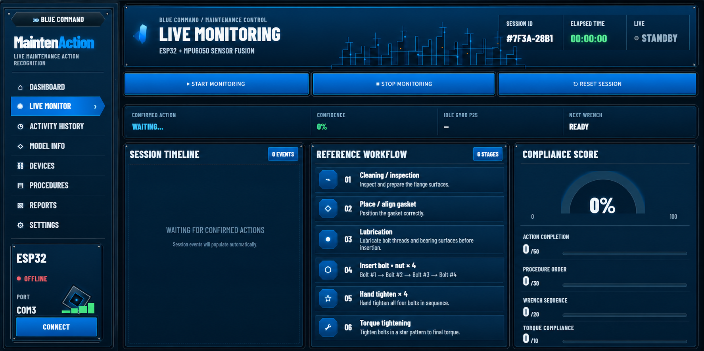

# 🔧 MaintenAction

### Real-Time Maintenance Procedure Monitoring from a Wrist Sensor

<p align="center">
  
</p>

**MaintenAction** is a wrist-mounted motion monitoring system designed to recognize maintenance actions and track whether a maintenance procedure is being performed correctly.

An **MPU-6050** worn on the worker's wrist captures accelerometer and gyroscope data. The motion data is processed by a **CNN-LSTM model**, while additional logic tracks the procedure and identifies possible skipped, repeated, or incorrect steps.

---

## ✨ What It Does

⌚ **Wrist Motion Tracking**  
Captures the worker's hand movements using an MPU-6050 sensor.

🧠 **Action Recognition**  
Uses a CNN-LSTM model to classify maintenance actions in real time.

📋 **Procedure Monitoring**  
Tracks the expected maintenance sequence as the worker progresses.

⚠️ **Mistake Detection**  
Helps identify skipped steps, incorrect ordering, and unexpected actions.

🛢️ **Lubrication Stroke Counting**  
Detects lubrication activity and counts the number of lubrication strokes performed.

🔩 **Bolt Sequence Monitoring**  
Tracks wrench-tightening actions and distinguishes **cross vs adjacent bolt transitions** to verify the correct tightening sequence.

---

## 🛠️ Actions Recognized

| Action | Description |
|---|---|
| 🧹 **Cleaning / Inspection** | Preparing and inspecting the flange surfaces |
| 🟣 **Place / Align Gasket** | Positioning and aligning the gasket |
| 🛢️ **Lubrication** | Lubricating bolt threads and counting lubrication strokes |
| 🔩 **Insert Bolt + Nut** | Installing bolts and nuts |
| ✋ **Hand Tighten** | Initial tightening by hand |
| 🔧 **Wrench Tighten** | Tightening bolts and monitoring cross vs adjacent bolt movement |

---

## ⚙️ How It Works

```text
        WRIST MOVEMENT
              ↓
       MPU-6050 SENSOR
              ↓
      ESP32 DATA STREAM
              ↓
     MOTION PREPROCESSING
              ↓
        CNN-LSTM MODEL
              ↓
      ACTION RECOGNITION
              ↓
     PROCEDURE MONITORING
              ↓
       STREAMLIT DASHBOARD
```

---

## 🧰 Technology

* **Python**
* **TensorFlow**
* **Keras**
* **Streamlit**
* **ESP32**
* **MPU-6050**
---

## 🎯 Why MaintenAction?

Maintenance procedures may already be documented, but verifying how they are actually performed is much harder.

MaintenAction explores how wrist motion data can provide:

* Better procedure compliance
* Automatic maintenance handovers
* Detection of procedural mistakes
* Maintenance training support
* Digital records of performed actions
* Less reliance on manual supervision

---

## 🔗 Links

🌐 **Live App:** [Open MaintenAction](https://maintenaction-7979.streamlit.app/)

🎥 **Demo Video:** [Watch the Demo](https://youtu.be/T5GHJUT8dPM)

---

<p align="center">
  <b>MAKING MAINTENANCE TRACKABLE AND VERIFIABLE</b>
</p>

<p align="center">
  🔧 ⌚ 📊 ⚙️ 🔩
</p>
